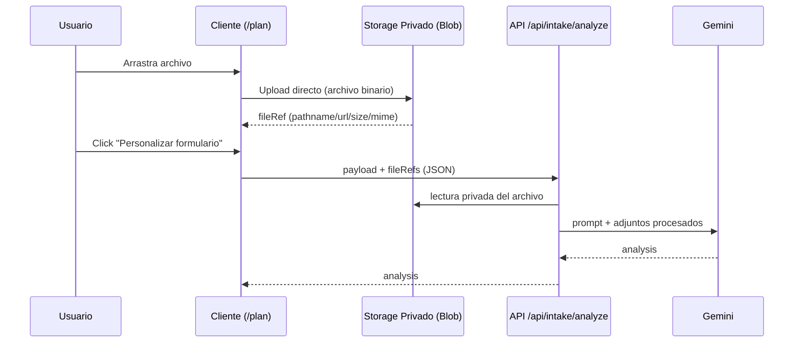

# Arquitectura Objetivo En Este Repo

## Problema actual

Hoy el cliente manda archivos binarios a:

- `POST /api/intake/analyze`

mediante `FormData` desde [routine-builder.tsx](/Users/victorsaiz/Documents/MyCoach/src/components/routine-builder.tsx).  
Cuando el body supera el límite de la plataforma, aparece `413 Content Too Large`.

## Estado actual relevante del código

- Cliente: [routine-builder.tsx](/Users/victorsaiz/Documents/MyCoach/src/components/routine-builder.tsx)
  - `contextFiles` y `visualFiles` se envían completos en `FormData`.
- Backend intake: [route.ts](/Users/victorsaiz/Documents/MyCoach/src/app/api/intake/analyze/route.ts)
  - consume `request.formData()` y procesa `File`.
- Procesado de adjuntos: [file-intelligence.ts](/Users/victorsaiz/Documents/MyCoach/src/lib/file-intelligence.ts)

## Arquitectura nueva (sin 413)

1. Cliente sube primero a storage privado (direct upload).
2. Cliente recibe referencias (`pathname`, `url`, `size`, `mimeType`).
3. Cliente llama a `/api/intake/analyze` enviando:
   - `payload` del formulario
   - lista de referencias de archivos subidos
4. Backend descarga/lee desde storage y construye `attachments` para Gemini.

## Diagrama



## Endpoints sugeridos

- `POST /api/uploads/context`  
  Devuelve autorización o token para subida privada de documento.

- `POST /api/uploads/visual`  
  Devuelve autorización o token para subida privada de imagen/video.

- `POST /api/intake/analyze`  
  Recibe JSON con `profile` + `contextAssets[]` + `visualAssets[]`.

## Contrato recomendado para referencias

```ts
type UploadedAsset = {
  provider: "vercel-blob";
  kind: "context" | "visual";
  pathname: string;
  url: string;
  mimeType: string;
  size: number;
  filename: string;
};
```

## Cambios de código por archivo

### Cliente

- [routine-builder.tsx](/Users/victorsaiz/Documents/MyCoach/src/components/routine-builder.tsx)
  - sustituir envío de `File` por subida directa y envío de `UploadedAsset`.
  - mantener validación local de formato/peso ya implementada.

### Backend intake

- [route.ts](/Users/victorsaiz/Documents/MyCoach/src/app/api/intake/analyze/route.ts)
  - dejar de parsear `File` desde `formData`.
  - parsear JSON con referencias y leer desde storage.

### Inteligencia de archivos

- [file-intelligence.ts](/Users/victorsaiz/Documents/MyCoach/src/lib/file-intelligence.ts)
  - añadir adaptación de `UploadedAsset` -> `ProcessedAttachment`.
  - para visual, descargar stream/buffer desde storage en servidor.

### Tipos

- [types.ts](/Users/victorsaiz/Documents/MyCoach/src/lib/types.ts)
  - declarar `UploadedAsset` y payload nuevo de intake.

## Concurrencia y aislamiento

Con subidas simultáneas:

- usar `sessionId` + `uuid` en key.
- no hay condición de carrera entre usuarios si no compartes key.
- el análisis debe operar por `sessionId`.

## Privacidad y seguridad

- objetos privados.
- acceso backend con token de lectura/escritura.
- URLs firmadas con expiración corta si se exponen al cliente.
- borrado al finalizar el análisis o job de limpieza.

